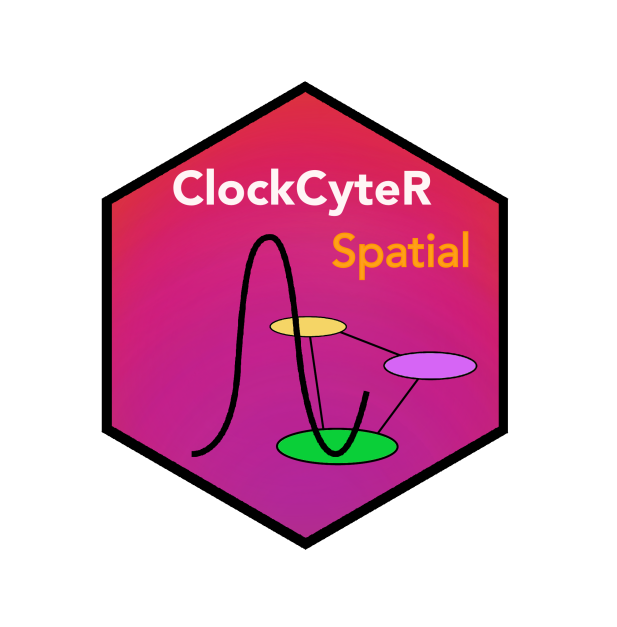

# ClockCyteR.spatial [](https://github.com/cabaJr/ClockCyteR.spatial)

[](https://lifecycle.r-lib.org/articles/stages.html#experimental)
[](https://codecov.io/github/cabaJr/ClockCyteR.spatial)
[](https://github.com/cabaJr/ClockCyteR.spatial/actions/workflows/R-CMD-check.yaml)
[](https://github.com/cabaJr/ClockCyteR.spatial)

  

## Overview

ClockCyteR.spatial is an R package for spatiotemporal analysis of
circadian rhythms from multichannel live-imaging time series. Starting
from fluorescence intensity data extracted from user-defined regions of
interest, it estimates circadian parameters (period, phase, amplitude)
at single-cell resolution, maps them spatially, and computes
network-level synchrony metrics. The package was developed for
organotypic Suprachiasmatic Nucleus (SCN) slices but is applicable to
any spatially resolved oscillatory time series.


## Installation

You can install the development version of ClockCyteR.spatial from
GitHub:

``` r

# install.packages("remotes")
remotes::install_github("cabaJr/ClockCyteR.spatial")
```

## Prerequisites: ImageJ preprocessing

Before using ClockCyteR.spatial, raw multichannel TIFF time series must
be preprocessed in FIJI/ImageJ to generate the required `_results`
folder structure. A set of ImageJ macros for this step is available in
the companion repository:
[ClockCyteR.FIJI](https://github.com/cabaJr/ClockCyteR.FIJI)

The macros should be run in order:

1.  `1.Rotate_expand_stack` — align and crop stacks to a consistent
    orientation
2.  `2.Extract_hemislices` — extract left/right SCN hemislices from the
    full stack
3.  `3.Define_ROI` — define the SCN nucleus ROI and extract intensity
    profiles
4.  `4.Extract_cellgrid_cycle` — create the measurement grid and extract
    per-cell intensities

Steps 3 and 4 generate the `_results/` folders consumed by
[`index_files()`](https://cabajr.github.io/ClockCyteR.spatial/reference/index_files.md).

## Citation

If you use ClockCyteR.spatial in your research, please cite:

Ferrari et al. (2026, Advanced Science). *A high-throughput live imaging
platform to investigate circuit-dependent regulation of circadian
rhythms in brain tissue.*

## Usage

A template to run the code using the toy dataset is available here.

``` r


# Copy the toy dataset to a writable location (avoids writing into the package folder)
base_dir <- setup_example()           # or setup_example("~/my_analysis") for a persistent copy

params <- make_params(
  channels = list(
    Ch1 = list(
      enabled = FALSE,
      label = "red_channel",
      grid_file = "Ch1_1_grid_vals.csv"
    ),
    Ch2 = list(
      enabled = TRUE,
      label = "Syn-Axon-GCaMP6s",
      grid_file = "Ch2_2_grid_vals.csv"
    ),
    Ch3 = list(
      enabled = FALSE,
      label = "Brightfield",
      grid_file = "Ch3_3_grid_vals.csv"
    )
  ),
  coherence = TRUE,
  normalize_phase = TRUE,
  time_res = 0.5,
  intervals = list("interval1" = c(0, 72)),
  time_window = TRUE,
  pixel_fct = 2.82,
  plotting = list(
    y_limits_from_previous = FALSE,
    align = list("Ch2" = "12"),
    colors = list(
      Ch2 = "darkgreen"
    )
  ),
  folder_structure = list(
    base_dir = base_dir # change to your actual folder when using your own data
  )
)

# index files ####
file_rows <- index_files(paths = params$paths)

# analyze project ####
analysis_results <- analyze_project(file_rows = file_rows,
                                    params = params)

# calculate plot ranges
ranges <- ranges_calculation(params = params, file_rows = file_rows)
params$plotting$ranges <- ranges

# Visualization ####

# generate plots
generate_plots(file_rows =  file_rows, params = params)

# pull plots in a simple folder
pull_plots(params = params, file_rows = file_rows)

# generate file reports
generate_reports(params = params, file_rows = file_rows)
generate_plot_type_reports(params = params, file_rows = file_rows)
```
